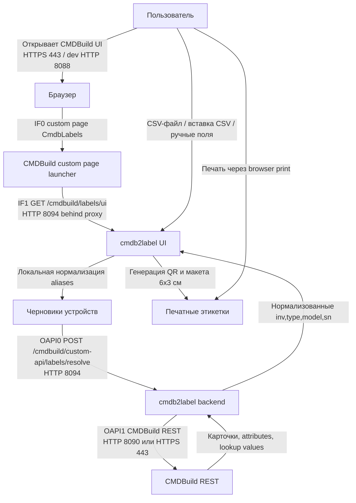

# Описание бизнес-процессов

## BP-001 Генерация этикеток пользователем

Позитивный сценарий:

1. Пользователь открывает CMDBuild через тот же reverse proxy, где опубликованы labels routes.
2. Custom page `CmdbLabels` открывает `/cmdbuild/labels/ui`.
3. Пользователь загружает CSV, вставляет CSV или вводит одну карточку парами `атрибут` / `значение`.
4. UI нормализует известные aliases и запрашивает CSRF token.
5. Backend дозапрашивает недостающие поля через CMDBuild REST с текущей CMDBuild session cookie.
6. Backend возвращает строки этикеток, UI строит QR локально и показывает preview/print layout.

## BP-002 Негативные сценарии

| Сценарий | Поток | Поведение | Событие |
| --- | --- | --- | --- |
| Нет CMDBuild session cookie | `OAPI0` | API возвращает `401`; UI показывает неактивную CMDBuild session | `http.request.finish` |
| Origin/Referer не same-origin | `OAPI0` | `POST /resolve` возвращает `403` до обращения в CMDBuild | `http.request.finish` |
| Неверный CSRF token | `OAPI0` | `POST /resolve` возвращает `403` | `http.request.finish` |
| Не JSON body | `OAPI0` | `POST /resolve` возвращает `415` | `http.request.finish` |
| `devices` не массив | `OAPI0` | `POST /resolve` возвращает `400` | `http.request.finish` |
| Слишком большой batch | `OAPI0` | `POST /resolve` возвращает `413` | `http.request.finish` |
| Карточка не найдена или нет обязательных полей | `OAPI1` | Ответ `422` с ошибками по строкам | `labels.resolve`, `http.request.finish` |
| CMDBuild недоступен | `OAPI1`, `H0` | `/health/ready` возвращает `503`; пользовательский API возвращает безопасную ошибку | `health.check_failed` или события ошибки upstream |

## BP-003 Вспомогательные процессы

| Процесс | Поток | Назначение | Событие |
| --- | --- | --- | --- |
| Проверка liveness/readiness | `H0` | LB/monitoring проверяет процесс и зависимость CMDBuild | `http.request.finish` |
| Сбор метрик | `M0` | Prometheus-compatible scrape агрегированных счетчиков | `http.request.finish` |
| Логирование приложения | `L0` | Structured JSON logs в stdout/stderr и optional syslog | `app.started`, `app.config_invalid`, `http.request.finish` |
| Регистрация custom page | `OAPI2` | Администратор загружает zip launcher в CMDBuild | Вывод CLI `register:custompage`, аудит CMDBuild вне сервиса |
| Подготовка Customer CA / APT mirror | `IF2` | Подготовка доверия к private CA и package mirror при build/runtime | Вывод Docker build, deployment logs |
