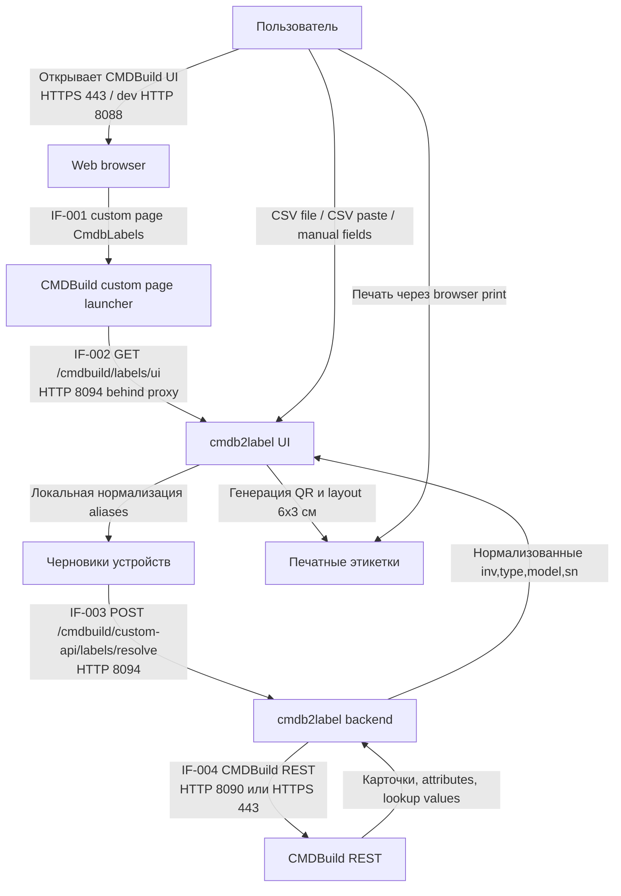

# Описание бизнес-процессов

## BP-001 Генерация этикеток пользователем

Позитивный сценарий:

1. Пользователь открывает CMDBuild через тот же reverse proxy, где опубликованы labels routes.
2. Custom page `CmdbLabels` открывает `/cmdbuild/labels/ui`.
3. Пользователь загружает CSV, вставляет CSV или вводит одну карточку парами `атрибут` / `значение`.
4. UI нормализует известные aliases и запрашивает CSRF token.
5. Backend дозапрашивает недостающие поля через CMDBuild REST с текущей CMDBuild session cookie.
6. Backend возвращает строки этикеток, UI строит QR локально и показывает preview/print layout.

## BP-002 Негативные сценарии

| Сценарий | Поток | Поведение | Событие |
| --- | --- | --- | --- |
| Нет CMDBuild session cookie | `IF-003` | API возвращает `401`; UI показывает неактивную CMDBuild session | `http.request.finish` |
| Origin/Referer не same-origin | `IF-003` | `POST /resolve` возвращает `403` до обращения в CMDBuild | `http.request.finish` |
| Неверный CSRF token | `IF-003` | `POST /resolve` возвращает `403` | `http.request.finish` |
| Не JSON body | `IF-003` | `POST /resolve` возвращает `415` | `http.request.finish` |
| `devices` не массив | `IF-003` | `POST /resolve` возвращает `400` | `http.request.finish` |
| Слишком большой batch | `IF-003` | `POST /resolve` возвращает `413` | `http.request.finish` |
| Карточка не найдена или нет обязательных полей | `IF-004` | Ответ `422` с row-level errors | `labels.resolve`, `http.request.finish` |
| CMDBuild недоступен | `IF-004`, `IF-005` | `/health/ready` возвращает `503`; пользовательский API возвращает safe error | `health.check_failed` или upstream failure events |

## BP-003 Вспомогательные процессы

| Процесс | Поток | Назначение | Событие |
| --- | --- | --- | --- |
| Проверка liveness/readiness | `IF-005` | LB/monitoring проверяет процесс и CMDBuild dependency | `http.request.finish` |
| Сбор метрик | `IF-005` | Prometheus-compatible scrape агрегированных counters | `http.request.finish` |
| Логирование приложения | `IF-006` | Structured JSON logs в stdout/stderr и optional syslog | `app.started`, `app.config_invalid`, `http.request.finish` |
| Регистрация custom page | `IF-007` | Администратор загружает zip launcher в CMDBuild | `register:custompage` CLI output, CMDBuild audit outside service |
| Customer CA / APT mirror preparation | `IF-008` | Подготовка доверия к private CA и package mirror при build/runtime | Docker build output, deployment logs |
