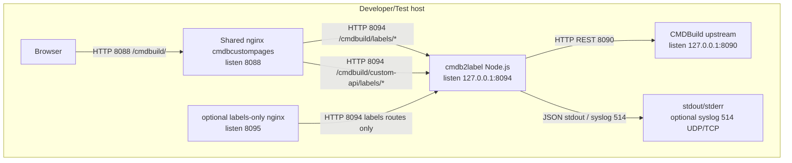
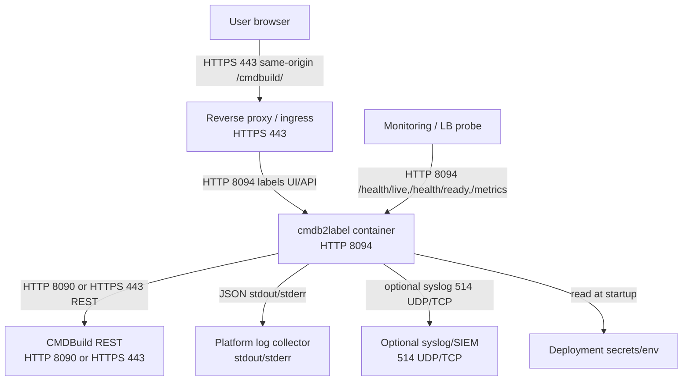
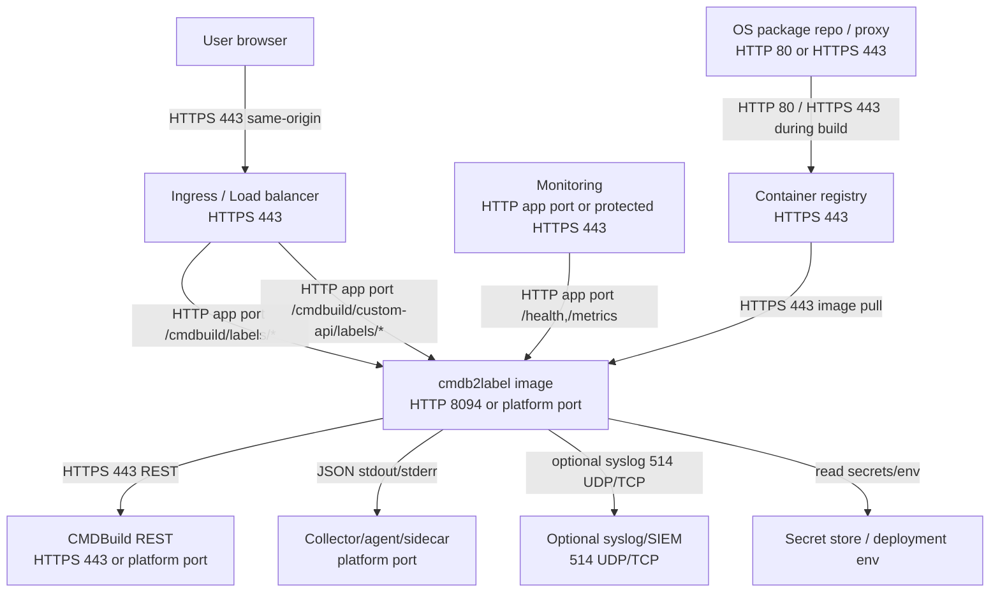

# Схема развертывания

Окружение разработки приведено справочно. По стандарту обязательными считаются контуры Test IT, Business Test и Production; конкретные hostnames, сертификаты и ingress-адреса задаются площадкой эксплуатации.

## Development / локальный стенд

Notes:

- User-facing dev entrypoint is `http://localhost:8088/cmdbuild/`.
- Direct CMDBuild upstream `8090` is not a supported user entrypoint for `cmdb2label` custom page routes.
- Optional `8095` overlay is labels-only and does not own general `/cmdbuild/`.

## Test IT

## Business Test

Business Test repeats the Test IT logical topology. Differences are deployment-specific:

- ingress host, TLS certificate, and CMDBuild origin are provided by the platform;
- `CMDB_LABELS_CSRF_SECRET` must be stable and externally managed;
- customer alias config and class root must match the Business Test CMDBuild model;
- if private CA is used, mount it read-only and set `NODE_EXTRA_CA_CERTS`.

## Production

Production requirements:

- runtime compose uses prebuilt `image:`, not `build:`;
- base compose does not force a Docker logging driver, collector, or syslog topology;
- stdout-only production requires `CMDB_LABELS_LOG_EXTERNAL_SINK=platform|collector|sidecar|docker-driver`;
- direct syslog is optional through `CMDB_LABELS_LOG_TARGET=stdout,syslog`;
- real customer CA files and fingerprints remain deployment artifacts and are not committed.
