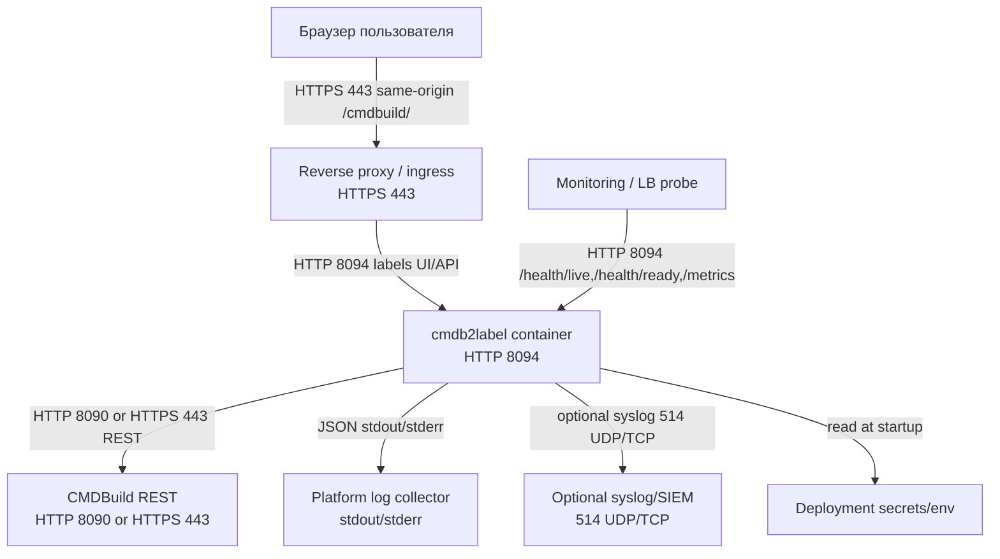
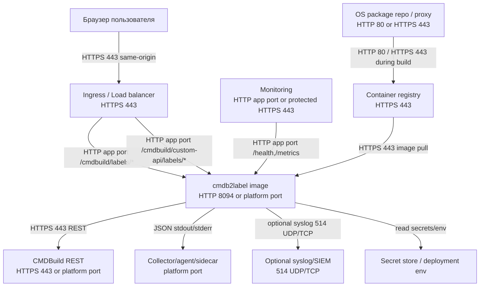

# Схема развертывания

Окружение разработки приведено справочно. По стандарту обязательными считаются контуры Test IT, Business Test и Production; конкретные hostnames, сертификаты и ingress-адреса задаются площадкой эксплуатации.

## Development / локальный стенд

Примечания:

- Пользовательская точка входа dev-стенда: `http://localhost:8088/cmdbuild/`.
- Прямой CMDBuild upstream `8090` не является поддерживаемой пользовательской точкой входа для custom page routes `cmdb2label`.
- Optional overlay `8095` обслуживает только labels routes и не владеет общим `/cmdbuild/`.

## Test IT

## Business Test

Business Test повторяет логическую топологию Test IT. Отличия зависят от развертывания:

- ingress host, TLS certificate и CMDBuild origin предоставляются платформой;
- `CMDB_LABELS_CSRF_SECRET` должен быть стабильным и управляться вне приложения;
- customer alias config и class root должны соответствовать модели CMDBuild в Business Test;
- если используется private CA, ее нужно смонтировать read-only и задать `NODE_EXTRA_CA_CERTS`.

## Production

Требования Production:

- runtime compose использует готовый `image:`, а не `build:`;
- base compose не навязывает Docker logging driver, collector или syslog topology;
- stdout-only production требует `CMDB_LABELS_LOG_EXTERNAL_SINK=platform|collector|sidecar|docker-driver`;
- прямой syslog опционален через `CMDB_LABELS_LOG_TARGET=stdout,syslog`;
- реальные customer CA files и fingerprints остаются deployment artifacts и не коммитятся.
