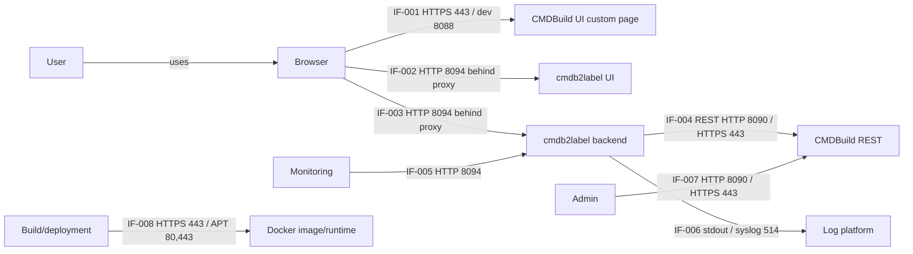

# Информационная модель

## Участники

| Участник | Тип | Назначение |
| --- | --- | --- |
| User | Человек | Оператор, генерирующий этикетки |
| Browser | Клиентское приложение | CMDBuild UI, custom page launcher и cmdb2label UI |
| Reverse proxy / ingress | Системный компонент | Same-origin публикация CMDBuild UI и labels routes |
| CMDBuild | Внешняя система | Сессии, права, карточки оборудования, attributes, lookup values |
| cmdb2label backend | Приложение | UI serving, labels API, CMDBuild REST client, QR/label data enrichment |
| Monitoring | Системный компонент | Health, readiness, metrics checks |
| Log platform | Системный компонент | stdout/stderr collector, optional syslog/SIEM |
| Registry/build platform | Системный компонент | Docker build, customer CA/APT mirror, image identity |

## Потоки

| ID | Source | Target | Channel / endpoint / topic | Port | Data | Direction | Auth/secret | Notes |
| --- | --- | --- | --- | --- | --- | --- | --- | --- |
| IF-001 | Browser | CMDBuild custom page `CmdbLabels` | CMDBuild UI custom page route | HTTPS 443; dev HTTP 8088 | Launcher JS metadata | Browser receives launcher | CMDBuild session cookie is HttpOnly | Launcher does not read cookie |
| IF-002 | Browser | cmdb2label backend | `GET /cmdbuild/labels/ui` | HTTP 8094 behind proxy; external HTTPS 443 | HTML/CSS/JS UI | Backend sends UI to browser | Same-origin cookies travel automatically | UI includes version/footer and local QR generation |
| IF-003 | Browser | cmdb2label backend | `/cmdbuild/custom-api/labels/*` | HTTP 8094 behind proxy; external HTTPS 443 | Session status, CSRF, device drafts, resolved label rows, client diagnostics | Bidirectional HTTP | `CMDBuild-Authorization` HttpOnly cookie, `X-CMDB2Label-CSRF` for state-changing API | Browser JS never reads CMDBuild cookie |
| IF-004 | cmdb2label backend | CMDBuild REST | `/cmdbuild/services/rest/v3/*` on `CMDBUILD_ORIGIN` | Default HTTP 8090; production HTTPS 443 or platform port | Classes, attributes, cards, lookup values, session data | Backend sends requests; CMDBuild returns data | Backend forwards `CMDBuild-Authorization` header server-side | No direct SQL access |
| IF-005 | Monitoring / operator | cmdb2label backend | `/health/live`, `/health/ready`, `/about`, `/metrics`, API-prefixed health/about | HTTP 8094; external protected route/platform port | Safe liveness, readiness, build identity, metrics | Backend returns operational data | No business data; API logging status needs CMDBuild session | `/metrics` should be internal/protected |
| IF-006 | cmdb2label backend | Log platform | JSON stdout/stderr, optional syslog | stdout/stderr no network port; syslog 514 UDP/TCP | Structured events and diagnostics | Backend emits logs | Secrets redacted; external sink declared by config | `Verbose` diagnostics temporary only |
| IF-007 | Admin CLI/browser | CMDBuild custompages API | `npm run register:custompage` / CMDBuild UI upload | CMDBuild HTTP 8090 or HTTPS 443 | Custom page zip and metadata | Admin uploads launcher | Admin credentials or session cookie | Not part of end-user label flow |
| IF-008 | Build/deployment operator | Docker build/runtime | Dockerfile CA/APT and compose CA mount | Registry HTTPS 443; APT HTTP 80/HTTPS 443; app HTTP 8094 | Image layers, CA bundle, APT sources, runtime env | Build/runtime consumes artifacts | Customer CA is deployment artifact, not app secret | Real certs/fingerprints are not committed |

## Основные данные

| Объект | Поля | Источник | Использование |
| --- | --- | --- | --- |
| Device draft | `inv`, `type`, `model`, `sn`, internal `lookupKey` | CSV/file/paste/manual UI | Input to `/resolve`; `lookupKey` never printed |
| Label row | `inv`, `type`, `model`, `sn` | Backend merge of user input and CMDBuild data | Printed label and QR payload |
| Alias config | `aliases`, `derivedFields.typeFromModelLookupParent` | `/etc/cmdb2label/aliases.json` or inline env | Attribute matching and lookup parent derivation |
| CMDBuild catalog cache | Classes, attributes, lookup metadata | CMDBuild REST per session/config hash | Search space and field metadata |
| Build identity | `version`, `revision`, `sourceState`, runtime artifact SHA256 | `VERSION`, Docker build args, `/app/build-identity.json` | `/about`, `/health/*`, UI version |

## Схема потоков

