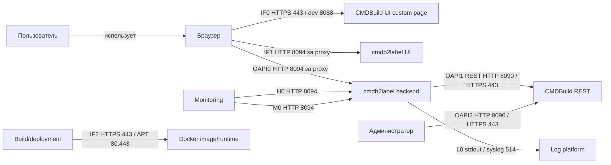

# Информационная модель

## Участники

| Участник | Тип | Назначение |
| --- | --- | --- |
| Пользователь | Человек | Оператор, генерирующий этикетки |
| Browser | Клиентское приложение | CMDBuild UI, custom page launcher и cmdb2label UI |
| Reverse proxy / ingress | Системный компонент | Same-origin публикация CMDBuild UI и labels routes |
| CMDBuild | Внешняя система | Сессии, права, карточки оборудования, attributes, lookup values |
| cmdb2label backend | Приложение | UI serving, labels API, CMDBuild REST client, QR/label data enrichment |
| Monitoring | Системный компонент | Health, readiness, metrics checks |
| Log platform | Системный компонент | stdout/stderr collector, optional syslog/SIEM |
| Registry/build platform | Системный компонент | Docker build, customer CA/APT mirror, image identity |

## Потоки

| ID | Источник | Получатель | Канал / endpoint / topic | Порт | Данные | Направление | Авторизация/секрет | Примечания |
| --- | --- | --- | --- | --- | --- | --- | --- | --- |
| IF0 | Browser | CMDBuild custom page `CmdbLabels` | Маршрут custom page в CMDBuild UI | HTTPS 443; dev HTTP 8088 | Метаданные launcher JS | Браузер получает launcher | CMDBuild session cookie имеет флаг HttpOnly | Launcher не читает cookie |
| IF1 | Browser | cmdb2label backend | `GET /cmdbuild/labels/ui` | HTTP 8094 за proxy; внешний HTTPS 443 | HTML/CSS/JS UI | Backend отдает UI в браузер | Same-origin cookies передаются автоматически | UI содержит версию/footer и локальную генерацию QR |
| OAPI0 | Browser | cmdb2label backend | `/cmdbuild/custom-api/labels/*` | HTTP 8094 за proxy; внешний HTTPS 443 | Статус сессии, CSRF, черновики устройств, строки этикеток, клиентская диагностика | Двунаправленный HTTP | `CMDBuild-Authorization` HttpOnly cookie, `X-CMDB2Label-CSRF` для state-changing API | Browser JS никогда не читает CMDBuild cookie |
| OAPI1 | cmdb2label backend | CMDBuild REST | `/cmdbuild/services/rest/v3/*` на `CMDBUILD_ORIGIN` | По умолчанию HTTP 8090; production HTTPS 443 или platform port | Classes, attributes, cards, lookup values, данные сессии | Backend отправляет запросы; CMDBuild возвращает данные | Backend пересылает header `CMDBuild-Authorization` server-side | Прямого SQL-доступа нет |
| H0 | Monitoring / operator | cmdb2label backend | `/health/live`, `/health/ready`, `/about`, API-prefixed health/about | HTTP 8094; внешний protected route/platform port | Безопасные liveness, readiness и build identity | Backend возвращает операционные данные | Бизнес-данных нет; API logging status требует CMDBuild session | Health/about endpoints должны быть internal/protected при публикации |
| M0 | Monitoring / operator | cmdb2label backend | `/metrics` | HTTP 8094; внешний protected route/platform port | Prometheus text metrics и build identity metric | Backend возвращает операционные метрики | Бизнес-данных нет | `/metrics` должен быть internal/protected |
| L0 | cmdb2label backend | Log platform | JSON stdout/stderr, optional syslog | stdout/stderr без сетевого порта; syslog 514 UDP/TCP | Structured events и diagnostics | Backend пишет логи | Секреты маскируются; external sink объявляется config | `Verbose` diagnostics только временно |
| OAPI2 | Admin CLI/browser | CMDBuild custompages API | `npm run register:custompage` / загрузка через CMDBuild UI | CMDBuild HTTP 8090 или HTTPS 443 | Custom page zip и metadata | Администратор загружает launcher | Admin credentials или session cookie | Не входит в пользовательский поток печати |
| IF2 | Build/deployment operator | Docker build/runtime | Dockerfile CA/APT и compose CA mount | Registry HTTPS 443; APT HTTP 80/HTTPS 443; app HTTP 8094 | Image layers, CA bundle, APT sources, runtime env | Build/runtime потребляет артефакты | Customer CA - deployment artifact, не app secret | Реальные certs/fingerprints не коммитятся |

HTTP-контракт публичного API `cmdb2label` описан в `aa/openapi.yaml`. Используемые endpoint внешнего CMDBuild REST для `OAPI1` и `OAPI2` описаны отдельно в `aa/openapi/cmdbuild-consumed.openapi.yaml`; файл фиксирует только фактически вызываемые операции, а не весь CMDBuild API.

## Основные данные

| Объект | Поля | Источник | Использование |
| --- | --- | --- | --- |
| Device draft | `inv`, `type`, `model`, `sn`, internal `lookupKey` | CSV/file/paste/manual UI | Вход `/resolve`; `lookupKey` никогда не печатается |
| Label row | `inv`, `type`, `model`, `sn` | Backend merge пользовательского ввода и данных CMDBuild | Печатная этикетка и QR payload |
| Alias config | `aliases`, `derivedFields.typeFromModelLookupParent` | `/etc/cmdb2label/aliases.json` or inline env | Attribute matching and lookup parent derivation |
| CMDBuild catalog cache | Classes, attributes, lookup metadata | CMDBuild REST per session/config hash | Область поиска и field metadata |
| Build identity | `version`, `revision`, `sourceState`, runtime artifact SHA256 | `VERSION`, Docker build args, `/app/build-identity.json` | `/about`, `/health/*`, UI version |

## Схема потоков

